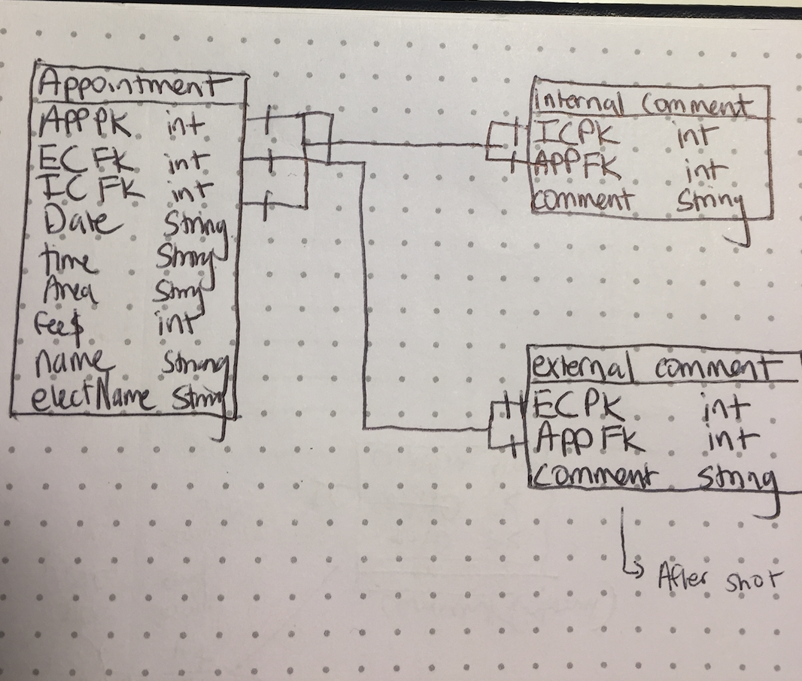

Summary: EzMEC is a Django / React SPA scheduling app with the goal of helping my Mom's small business become paperless
and more efficient. Currently all employees have their own appointment books and send pictures back and forth to 
communicate their schedules. Her client data base is also all on paper so the longer term goal is to have the appointment
forms feed the client data base to keep everything concise and organized. Eventually I would like to be able to incorporate
business metrics within the data base in order for my Mom to have the best information she needs, readily available, when
making decisions.

MVP: My MVP is a working SPA that allows employees to create and comment on appointments in one shared view. It will also have 
a place for employees to post before and after pictures of their clients. Additionally, it will implement a GoogleMaps API.

Stretch Goal: Moving forward I will anable the GoogleMaps API to bring in the address from the Appointments model
and collect data on where all MEC clients are coming from in order to better understand where a potential new location
would be most valuable. I will also connect the Images and Appointments models so that the client data base can hold everything
from total fees per customer to before and after pictures.

Link to my Trello board : https://trello.com/b/9DTzFm5T/gaproject-4ez-mec

Link to my Heroku deployed app: https://ezmec.herokuapp.com/api/v1/appointments/

ERD's and Wireframs:

